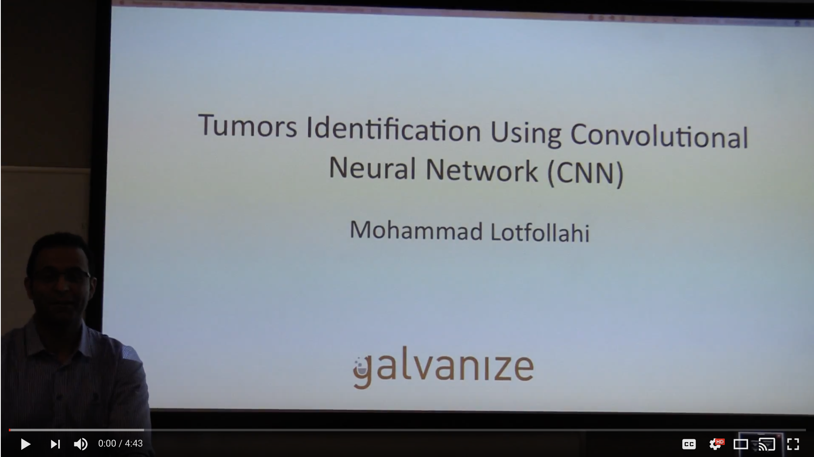
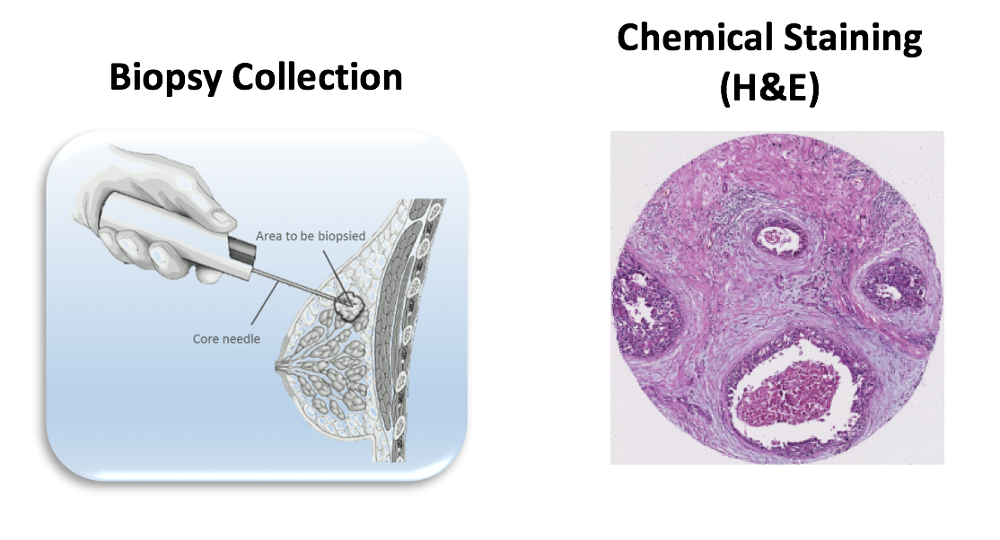

# Capstone Project

# Intruduction

Histopathology is the gold standard for cancer diagnosis and determining initial directions for treatment. The high level of morphological detail present in stained biopsies enables pathologists to determine the presence of cancer. 

