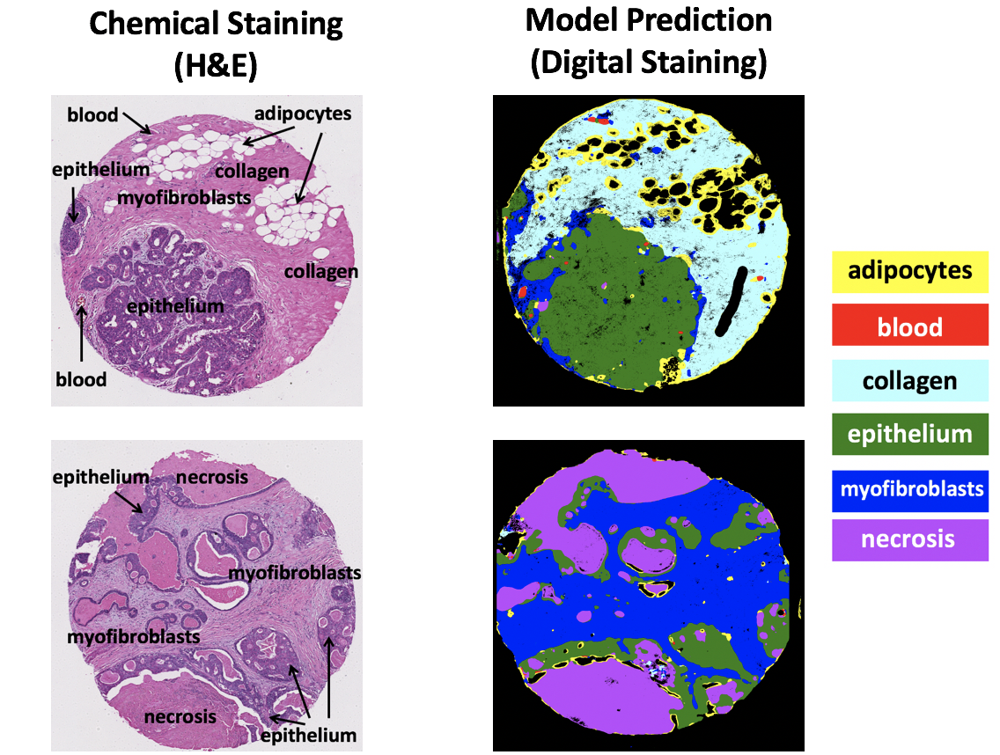

# Capstone Project

# Intruduction

Histopathology is the gold standard for cancer diagnosis and determining initial directions for treatment. The high level of morphological detail present in stained biopsies enables pathologists to determine the presence of cancer. 
Standard histopathology steps consist of biopsy collection, tissue preparation and sectioning, the application of chemical stains, and analysis by an expert pathologists. This process is done manually and has some limitations: 
1) Time-consuming and susceptible to human error
2) Chemical stains are non-quantitative
3) Heavily relied upon in clinical assessment

The alternative approache is Fourier transform infrared spectroscopy (FTIR). The  absorption spectra provide molecular fingerprints for each pixel, which translates to key cellular biomolecules, such as proteins, lipids, DNA, collagen, glycogen, and carbohydrates. Each pixel contains the spectrum generated by a Fourier Transform.

# Data Set and Goal

The dataset used in this study consisted of 540 breast tissue cores (with 1mm diameter) from different patients.
The goal is tissue classification in histological samples to generate a chemical map that can be used by a pathologist to identify the spatial distribution of tissue types within the sample.

# Work Flow 

# Model: Convolutional Nueral 

Convolutional neural networks (CNNs) are the current method of choice for image analysis, since they exploit spatial features by enforcing local patterns within the image. In addition to extracting spatial correlations between pixels, CNNs can be implemented for hyperspectral images, extracting correlations across the entire spectrum for a given pixel. CNNs have therefore become an effective machine learning tool for image classification tasks. 

Here is the CNN model used in this study: 

# Test Results 

The left pictures are biopcies stained in lab and different regions labeled by pathologist. The right images are same biopcies, stained and labeld by model.

## Test accuracy is 93% 

# Normalized Confusion Matrix 

# ROC Curve  

